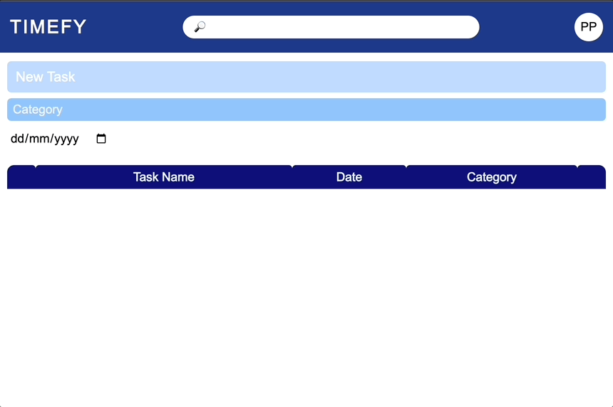
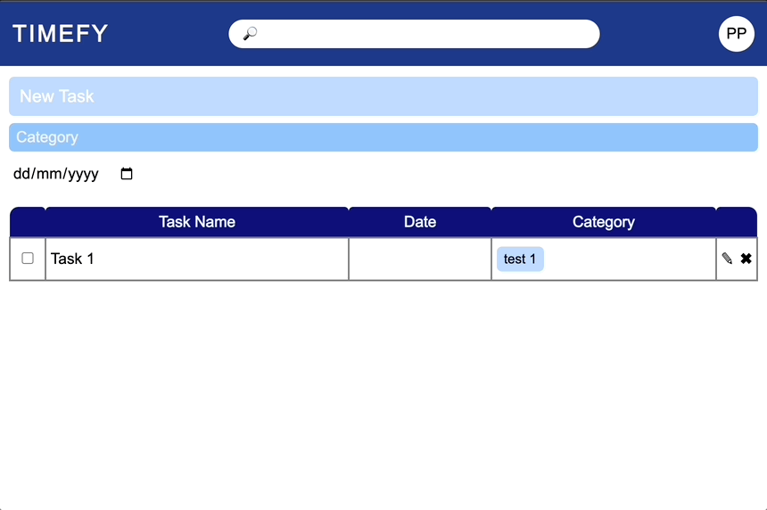
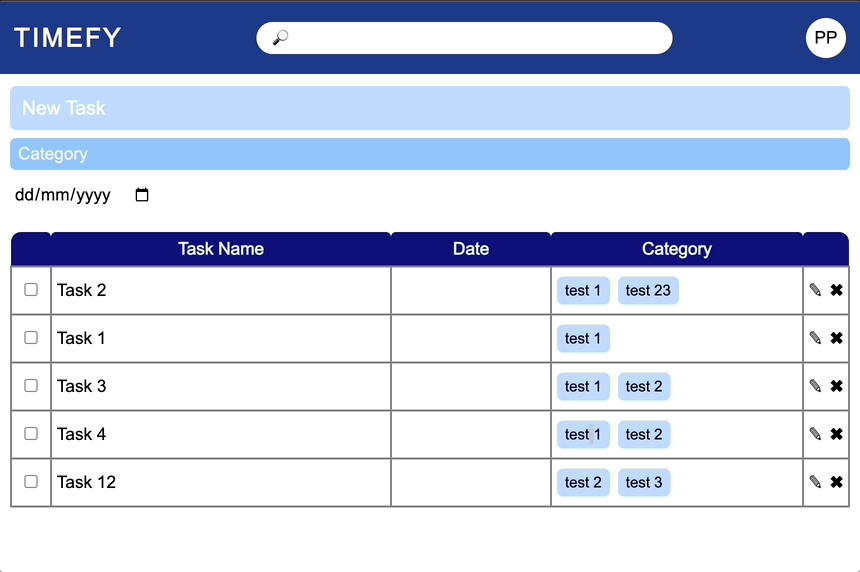
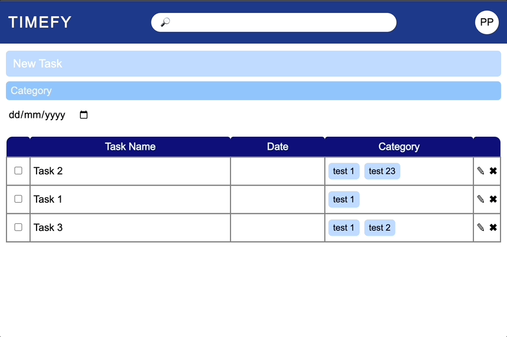

# Milestone 2

## Deskripsi Masalah

Mahasiswa seringkali mengalami kesulitan dalam mengelola prioritas tugas, sehingga dapat mengakibatkan keterlambatan dalam menyelesaikan tugas, peningkatan stres, dan penurunan produktivitas. Ketidakmampuan dalam mengatur waktu dengan baik juga bisa menyebabkan tumpang tindih antara tugas akademis dan kegiatan sosial/ekstrakurikuler, mengakibatkan ketidakseimbangan dalam menjalani peran sebagai mahasiswa.

## Solusi
Solusi yang diusulkan adalah pengembangan website "Timefy" yang dapat membantu mahasiswa dalam mengelola waktu dan tugas-tugas yang dimiliki secara lebih efektif. Website menyajikan alat praktis untuk mengatur, mengelompokkan, dan memprioritaskan tugas-tugas. Diharapkan dengan adanya website ini, mahasiswa bisa lebih menyadari tugas-tugas yang harus diselesaikan dan bisa mengatur prioritas dengan lebih baik. Fitur-fitur seperti pengingat, deadline, dan pengelompokkan berdasarkan kategori tugas akan membantu mahasiswa menjaga konsistensi dalam menjalani tugas-tugas akademis dan kegiatan lainnya serta meningkatkan pemanfaatan waktu secara lebih baik.

## Manfaat dari Solusi
1. Mengatur waktu secara efektif dan meningkatkan disiplin diri.
2. Mengklasifikasikan berbagai kategori dari pekerjaan atau tugas dan perencanaan jangka panjang.
3. Mengingatkan user akan tenggat waktu/deadline.
4. Menghindari prokrastinasi.
5. Meningkatkan fokus.
6. Menghindari dari lupa akan tugas yang ada.
7. Menghilangkan rasa cemas akibat lupa sudah mengerjakan tugas.
8. Memperjelas prioritas.
9. Meningkatkan produktivitas.
10. Mengurangi stres.
11. Melacak progress suatu tugas.
12. Menghindari kewalahan karena tugas menumpuk.

## Requirement
1. node.js > v20.0.0
1. npm > v9.6.4

## Cara Menggunakan Program
1. `npm i` untuk menginstall dependencies
1. `npm run build` untuk membuat file yang akan dijalankan di browser
1. `npm run start` untuk menjalankan server
1. Buka browser, lalu masukan URL berdasarkan tampilan di terminal (contohnya `https://localhost:3000`)  

[Figma](https://www.figma.com/file/jmmAqgzUTG5NmKzX7ZpkW8/Milestone-Kelompok-12?type=design&node-id=0-1&mode=design&t=e4K8Hk5dBHg4tCyX-0)

## Demo

### Create Task

### Update Task

### Delete Task

### Search Task

### Filter Task

### Date Task

### Save Data
Seluruh data yang dibuat dalam aplikasi ini disimpan menggunakan `localStorage`, yang artinya tetap berada dalam browser client.

## Identitas dan Kontribusi

| Nama | NIM | Kontribusi |
| --- | --- | --- |
| Ahmad Habibie Marjan 			    | 19622003 |    Manfaat dari solusi    |
| Shazya Audrea Taufik 			    | 19622016 |    Manfaat dari solusi dan Upload Proposal    |
| Habib Akhmad Al Farisi 		    | 19622017 |    Solusi dan Manfaat dari solusi    |
| Rici Trisna Putra 			    | 19622061 |    Membuat high fidelity prototype di Figma    |
| Hayya Zuhailii Kinasih 		    | 19622081 |    Manfaat dari solusi    |
| Eduardus Alvito Kristiadi 	    | 19622112 | Backend |
| Ahmad Hasan Albana 			    | 19622116 |    Styling Tabel    |
| Irfan Sidiq Permana 			    | 19622130 |    Membuat desain awal proyek    |
| Satria Wisnu Wibowo 			    | 19622145 |    Manfaat dari solusi    |
| Muhammad Atpur Rafif 			    | 19622222 | Front-end |
| Ahmad Fawwazi 				    | 19622234 |     Deskripsi masalah dan solusi   |
| Nathaniel Liady 				    | 19622284 |   Merumuskan ide-ide dan membantu Frontend   |
| Lina Azizah Ramadhani Hardyanti 	| 19622286 |    Membuat high fidelity prototype di Figma    |

